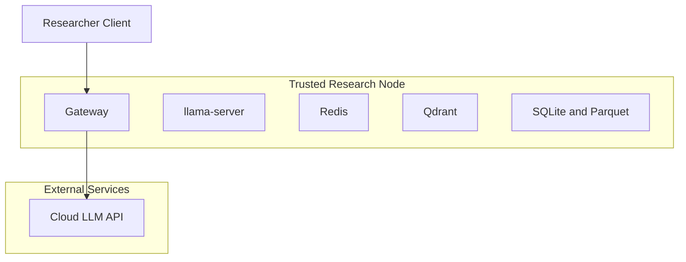

# Software Architecture Baseline

## Purpose

Define the actual software architecture implied by the budget documents, independent of machine cost tier.

## Status

- Architecture status: baseline design
- Implementation status: not yet present in this repository

## Source Assumptions

This architecture is derived from these references:

- `docs/budgets/00_budget_599.md`
- `docs/budgets/01_budget_2500.md`
- `docs/budgets/02_budget_5000.md`
- `docs/budgets/03_budget_7500.md`
- `docs/budgets/00_cloud_cost_model.md`
- `KNOWLEDGE_BASE_ITEMS.md`

## Architecture Drivers

- Local-first generation for normal load.
- Cloud fallback for hard tasks, overflow, and unresolved local runs.
- Canonical store in `SQLite + Parquet`, not markdown.
- Tool-agnostic read-only views over canonical data.
- Same software design across all budget tiers; only capacity and performance envelopes change.

## System Context

```mermaid
flowchart LR
  U[Researcher Client] --> G[Gateway API]

  subgraph N[Research Node]
    G --> L[llama-server]
    G --> R[Redis]
    G --> Q[Qdrant]
    G --> K[kb-writer]
    K --> S[SQLite]
    K --> P[Parquet]
    B[Backup Scheduler] --> S
    B --> P
  end

  G --> C[Cloud LLM Route]
  S --> V[Consumer Tools (Read-Only)]
  P --> V
```

## Logical Components

| Component | Role | Inputs | Outputs |
| --- | --- | --- | --- |
| `gateway` | Central control plane for routing, budgets, and fallback | client requests, queue state, policy | local or cloud invocation decisions, normalized responses |
| `llama-server` | Local OpenAI-compatible inference endpoint | prompt payload from gateway | local model responses |
| `redis` | Cache and queue coordination | request hashes, queue counters, state | cache hits, queue/pressure telemetry |
| `qdrant` | Retrieval memory by sector | query embeddings/filters | ranked context chunks |
| `kb-writer` | Canonical knowledge item writer | validated item payload plus provenance | normalized records in SQLite and Parquet |
| `consumer tools` | Optional read-only access layer | canonical records | tool-specific views, dashboards, or exports |
| `backup scheduler` | Snapshot/retention operations | SQLite and Parquet stores | recoverable backups |

## Trust Boundaries



Boundary notes:

- `gateway` is the only component that can invoke cloud APIs.
- cloud responses must re-enter through `gateway -> kb-writer` before any canonical store write.
- canonical stores are local institutional assets and should not be directly written by client tools.
- any downstream view tool is a derived consumer, not source-of-truth.

## Cross-Tier Invariance

The following are fixed across `$599`, `$2,500`, `$5,000`, `$7,500` tiers:

- component topology
- routing concepts (`local-default`, `local-long`, `cloud-hard`)
- DB-first enrichment and single escalation logic
- canonical data target (`SQLite + Parquet`)

What changes by tier:

- local memory envelope
- effective throughput (`mu_eff`)
- queue pressure and cloud spill rates
