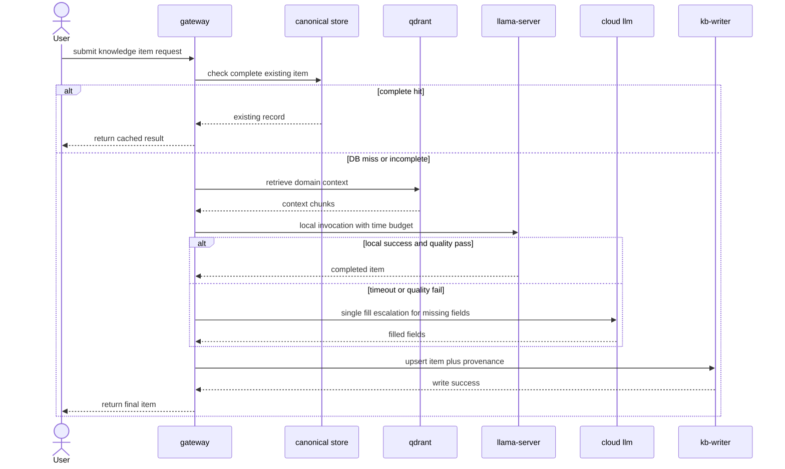
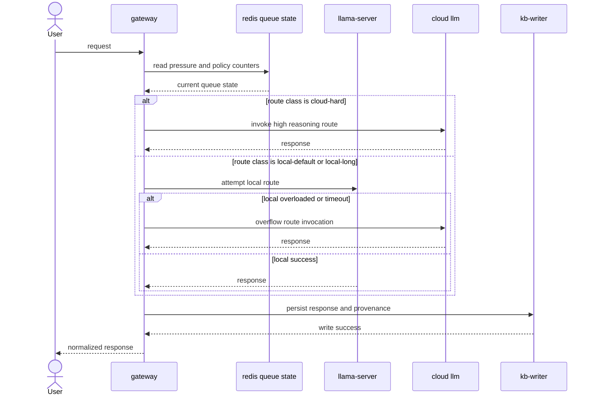

# Runtime Routing and Invocation Architecture

## Purpose

Define request lifecycle behavior and invocation contracts needed to implement the architecture.

## Routing Classes

Derived from budget docs:

- `local-default`: standard local route
- `local-long`: local route with larger context and stricter concurrency control
- `cloud-hard`: directly routed high-reasoning cloud path

## Core Routing Policy

1. classify request by task type, complexity, and policy tags.
2. if route class is `cloud-hard`, invoke cloud immediately.
3. otherwise check queue pressure and memory headroom.
4. attempt local route within configured local time budget.
5. if local route fails quality or exceeds budget, issue one cloud fill escalation call.
6. upsert final record with provenance.

## Cloud Reentry Rule

- cloud providers never write directly to canonical storage.
- every cloud response must pass through `gateway` normalization and then through `kb-writer`.
- mandatory persistence path: `cloud -> gateway -> kb-writer -> SQLite/Parquet`.

## End-to-End Sequence

## Overflow and Hard-Route Sequence

## Invocation Contracts

These contracts are proposed interfaces to implement; they do not exist yet in this repository.

| Interface | Proposed Contract | Notes |
| --- | --- | --- |
| Client to gateway | `POST /v1/chat/completions` | OpenAI-compatible ingress to keep client tooling stable. |
| Gateway to local inference | `POST <llama-server>/v1/chat/completions` | request passthrough with policy-controlled model/context limits. |
| Gateway to cloud route | provider adaptor call | normalization layer should make cloud response shape match local response shape. |
| Gateway to kb-writer | internal RPC or message queue | write path should include `item_id`, provenance, verification fields, and route metadata. |
| Cloud direct to store | not allowed | cloud output must re-enter through gateway and `kb-writer`. |

## Planned Invocation Artifacts

Expected implementation artifacts for this architecture:

- gateway router service
- local invocation adapter
- cloud invocation adapter
- writer service integration module
- policy and threshold configuration file

Current status: none of these artifacts are present yet.
