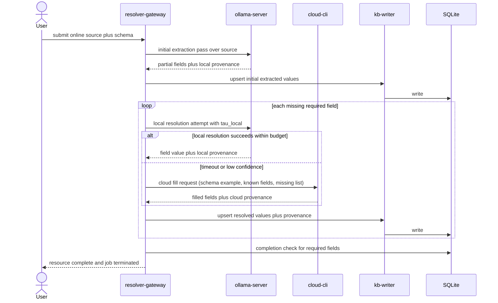

# Runtime Routing and Invocation Architecture (MVP)

## Purpose

Define the runtime lifecycle for one user-fed online resource in the MVP architecture.

## MVP Runtime Policy

For each user-fed resource, the resolver must execute this flow in order:

1. Ingest source and required schema fields.
2. Run initial local extraction pass with Ollama over the source content.
3. Upsert extracted fields into SQL (and related canonical stores) with provenance.
4. Enumerate still-missing required fields.
5. For each missing field, run local resolution with a fixed time budget (`tau_local`).
6. If local resolution exceeds budget or fails confidence threshold, issue one cloud CLI fill call.
7. Upsert cloud-filled values with provenance.
8. Repeat until all required fields for that resource are complete.
9. Terminate the resource job when completion criteria are met.

## Cloud Reentry Rule

- cloud providers never write directly to canonical storage.
- every cloud response must pass through resolver normalization and `kb-writer`.
- mandatory persistence path is `cloud -> resolver-gateway -> kb-writer -> SQLite/Parquet`.

## End-to-End MVP Sequence

## Termination Contract

A resource job is complete when:

- all required fields defined by schema are non-null, and
- provenance metadata exists for each resolved field, and
- final upsert has succeeded.

## Invocation Contracts

These are proposed contracts for MVP implementation; they are not implemented in this repository yet.

| Interface | Proposed Contract | Notes |
| --- | --- | --- |
| Client to resolver | `POST /mvp/ingest-source` | input should include source locator plus required field schema. |
| Resolver to Ollama | local Ollama API call | used for both initial extraction and timed local fill attempts. |
| Resolver to cloud fill | cloud CLI invocation | called only after local budget/confidence failure. |
| Resolver to writer | internal RPC or module call | centralizes normalization and write idempotency. |
| Cloud direct to store | not allowed | cloud output must re-enter through resolver and `kb-writer`. |

## Planned Invocation Artifacts

Expected MVP implementation artifacts:

- resolver-gateway service
- Ollama invocation adapter
- cloud CLI invocation adapter
- writer integration module
- schema-completion checker and `tau_local` policy config

Current status: none of these artifacts are present yet.
