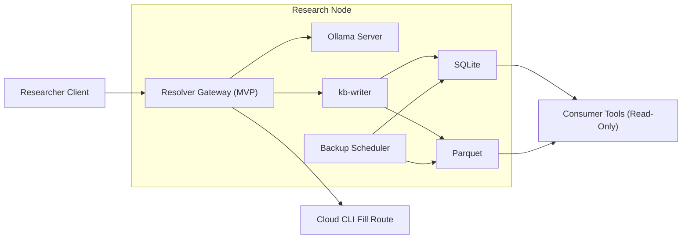
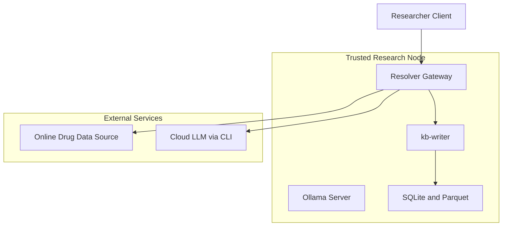

# Software Architecture Baseline (MVP)

## Purpose

Define the MVP architecture for user-fed online drug resources:

- local-first extraction and batched gap-fill using Ollama
- cloud CLI fallback for unresolved missing fields
- canonical persistence with provenance

## Status

- Architecture status: MVP baseline design

## Source Assumptions

This architecture is derived from these references:

- `docs/budgets/00_budget_599.md`
- `docs/budgets/01_budget_2500.md`
- `docs/budgets/02_budget_5000.md`
- `docs/budgets/03_budget_7500.md`
- `docs/budgets/00_cloud_cost_model.md`
- `KNOWLEDGE_BASE_ITEMS.md`

## MVP Design Decision

For MVP, orchestration and local resolution are treated as one logical service:

- `resolver-gateway` orchestrates DB checks, unresolved-entry batching, local fill attempts, cloud fallback, and completion checks.
- `ollama-server` performs local extraction/fill inference calls.

## Architecture Drivers

- Local-first enrichment for routine and missing-field resolution.
- DB-first completion scanning before any secondary web-aware enrichment.
- Batched unresolved-field resolution across entries with overlapping source context.
- Explicit local time budget (`tau_local`) on batched unresolved-field resolution before cloud fallback.
- Canonical store in `SQLite + Parquet`, not markdown.
- The `SQLite + Parquet` references in this repository are integration examples; production physical schema should be driven by brittleness-analysis requirements.
- Tool-agnostic read-only views over canonical data.
- Cloud responses must re-enter through the local write path with provenance.

## System Context

## Logical Components

| Component | Role | Inputs | Outputs |
| --- | --- | --- | --- |
| `resolver-gateway` | Orchestrates per-resource lifecycle, unresolved-entry batching, and policy enforcement | user-fed source, schema requirements, DB state | local/cloud resolution decisions, batch plans, normalized records |
| `ollama-server` | Local LLM inference for initial extraction and timed batch field filling | prompts from resolver-gateway plus grouped source context | extracted/filled values with local confidence signals |
| `cloud CLI adapter` | Executes one cloud fill call when batch local attempts exceed threshold | batched missing-field request, known fields, schema entries | filled fields and cloud provenance |
| `kb-writer` | Canonical write path | normalized values and provenance | upserts in SQLite and Parquet |
| `canonical store` | Source-of-truth dataset | writes from `kb-writer` only | queryable records for completion checks and analytics |
| `consumer tools` | Optional read-only access layer | canonical records | tool-specific views, dashboards, or exports |
| `backup scheduler` | Snapshot and retention operations | SQLite and Parquet stores | recoverable backups |

## Trust Boundaries

Boundary notes:

- only `resolver-gateway` can call external data sources or cloud LLM routes.
- cloud responses never write directly to canonical storage.
- mandatory persistence path is `cloud -> resolver-gateway -> kb-writer -> SQLite/Parquet`.
- downstream view tools are derived consumers, not source-of-truth.

## Cross-Tier Invariance

The following are fixed across `$599`, `$2,500`, `$5,000`, `$7,500` tiers:

- local-first plus cloud fallback workflow
- per-entry ingest plus DB-first completion scanning
- batched unresolved-field enrichment with per-resource completion-driven termination
- canonical data target (`SQLite + Parquet`)
- cloud reentry through `kb-writer`

What changes by tier:

- local memory envelope
- effective throughput (`mu_eff`)
- queue pressure and cloud spill rates
