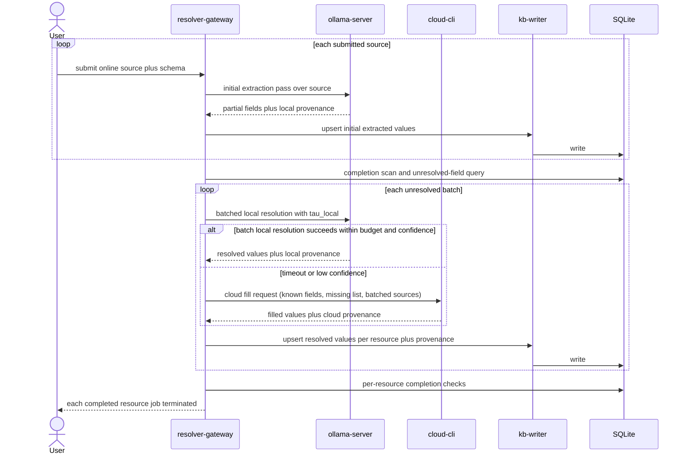

# Runtime Routing and Invocation Architecture (MVP)

## Purpose

Define the runtime lifecycle for user-fed online resources in the MVP architecture, including per-entry ingest and batched missing-field resolution.

## MVP Runtime Policy

The resolver must execute this flow in order:

1. Ingest each user-fed source with required schema fields.
2. Run an initial local extraction pass with Ollama for each ingested source.
3. Upsert extracted fields into SQL (and related canonical stores) with provenance.
4. Enumerate still-missing required fields from SQL across all unresolved resource jobs.
5. Build enrichment batches from unresolved entries, grouping by overlapping source context and missing-field shape.
6. For each batch, run local resolution with the same fixed time and confidence gates (`tau_local`, `q_min`).
7. If a batch local resolution exceeds budget or fails confidence threshold, issue one cloud CLI fill call for the unresolved batch payload.
8. Upsert resolved values per resource record with provenance and rerun completion checks.
9. Repeat batching until all required fields for each resource are complete.
10. Terminate each resource job independently when completion criteria are met.

## Batch Formation Rules

- keep ingest and initial extraction per resource for traceability and idempotency.
- batch only unresolved entries after the initial SQL upsert and deterministic completion scan.
- use stable batch keys that favor shared retrieval context (for example: source domain, schema type, and overlapping missing-field set).
- write results back per record; batching is an enrichment optimization, not a storage granularity change.
- avoid overwriting already-complete required fields unless explicit correction policy allows it.

## Cloud Reentry Rule

- cloud providers never write directly to canonical storage.
- every cloud response must pass through resolver normalization and `kb-writer`.
- mandatory persistence path is `cloud -> resolver-gateway -> kb-writer -> SQLite/Parquet`.

## End-to-End MVP Sequence

## Termination Contract

A resource job is complete when:

- all required fields defined by schema are non-null, and
- provenance metadata exists for each resolved field, and
- final upsert has succeeded.

Batch processing does not change these per-resource completion requirements.

## Invocation Contracts

These are proposed contracts for MVP implementation; they are not implemented in this repository yet.

| Interface | Proposed Contract | Notes |
| --- | --- | --- |
| Client to resolver | `POST /mvp/ingest-source` | input should include source locator plus required field schema. |
| Resolver to Ollama | local Ollama API call | used for both initial extraction and batched timed local fill attempts. |
| Resolver to cloud fill | cloud CLI invocation | called only after local batch budget/confidence failure. |
| Resolver to writer | internal RPC or module call | centralizes normalization and write idempotency. |
| Cloud direct to store | not allowed | cloud output must re-enter through resolver and `kb-writer`. |

## Planned Invocation Artifacts

Expected MVP implementation artifacts:

- resolver-gateway service
- Ollama invocation adapter
- cloud CLI invocation adapter
- unresolved-entry batch planner and grouping policy
- writer integration module
- schema-completion checker and `tau_local` policy config

Current status: none of these artifacts are present yet.
