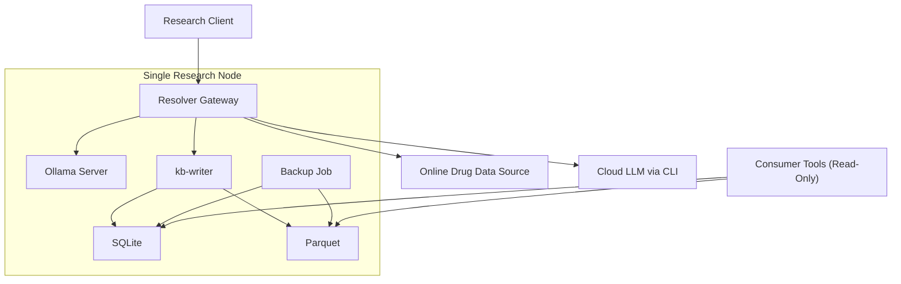

# Deployment and Operations Architecture (MVP)

## Deployment Baseline

MVP is a single-node deployment that resolves resource jobs through local-first enrichment, batched unresolved-field resolution, and cloud fallback.

## Runtime Control Plane

Control decisions are centralized in `resolver-gateway`:

- start and track per-resource job lifecycle
- run initial local extraction pass per resource through Ollama
- enumerate missing required fields after initial SQL upsert
- collate unresolved entries across active jobs and form enrichment batches
- enforce `tau_local` per local batch fill attempt
- evaluate confidence threshold before accepting local batch output
- invoke cloud CLI fallback when local batch attempts fail threshold
- apply resolved values as per-resource upserts with provenance
- enforce cloud reentry (`cloud -> resolver-gateway -> kb-writer -> canonical store`)
- terminate each job on schema completion

## Operational Metrics

The following metrics are required for MVP control and validation:

- `resources_started`, `resources_completed`, `resources_failed`
- `fields_required_total`, `fields_resolved_local`, `fields_resolved_cloud`
- `fields_unresolved`
- `batch_count`, `batch_size_avg`, `batch_size_p95`
- `local_attempt_count`, `local_timeout_count`, `batch_local_success_rate`
- `cloud_fill_call_count`, `cloud_fill_cost_usd`
- `batch_cloud_escalation_count`
- `completion_latency_sec` (per resource)
- `write_retry_count`, `write_failure_count`

## Failure Modes and Controls

| Failure Mode | Control |
| --- | --- |
| local extraction misses many fields | run deterministic missing-field scan immediately after initial upsert |
| local batch fill attempts exceed time budget | enforce `tau_local` and trigger cloud CLI fallback |
| low-confidence local batch fills | reject local fill and escalate to cloud CLI |
| overly mixed batches reduce answer quality | enforce batch-key constraints and max heterogeneity per batch |
| one large batch blocks smaller urgent jobs | cap batch size and use age-aware scheduling for unresolved entries |
| cloud output bypasses write policy | block direct DB writes; require resolver-gateway reentry path |
| canonical write failures | idempotent per-resource upserts, retries, and failed-write capture for replay |
| never-ending resource jobs | enforce termination rule based on required-field completion check |

## Termination Policy

A resource job terminates when:

- all required schema fields are complete in SQL, and
- provenance is present for each resolved field, and
- the final write transaction succeeds.

If unresolved fields remain after configured retry limits, terminate as failed and persist unresolved-field diagnostics.

## Backup and Recovery

- snapshot `SQLite` and `Parquet` on schedule.
- keep retention windows aligned with research cycle checkpoints.
- periodically test restore into a clean node.
- treat downstream read-only view artifacts as regenerable.

## Implementation Gap Register

This repository currently contains architecture documentation and budget analysis, but not a runnable MVP stack yet.
